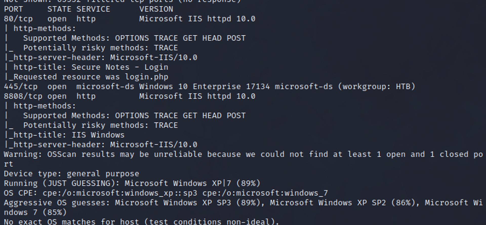
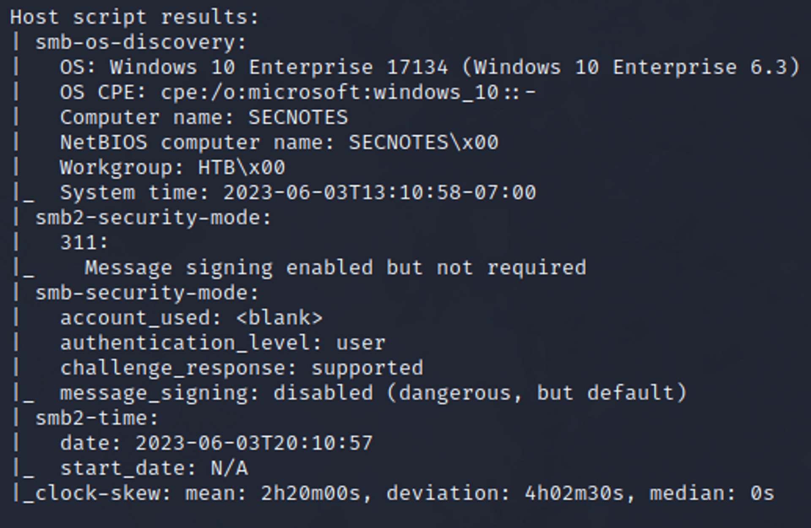
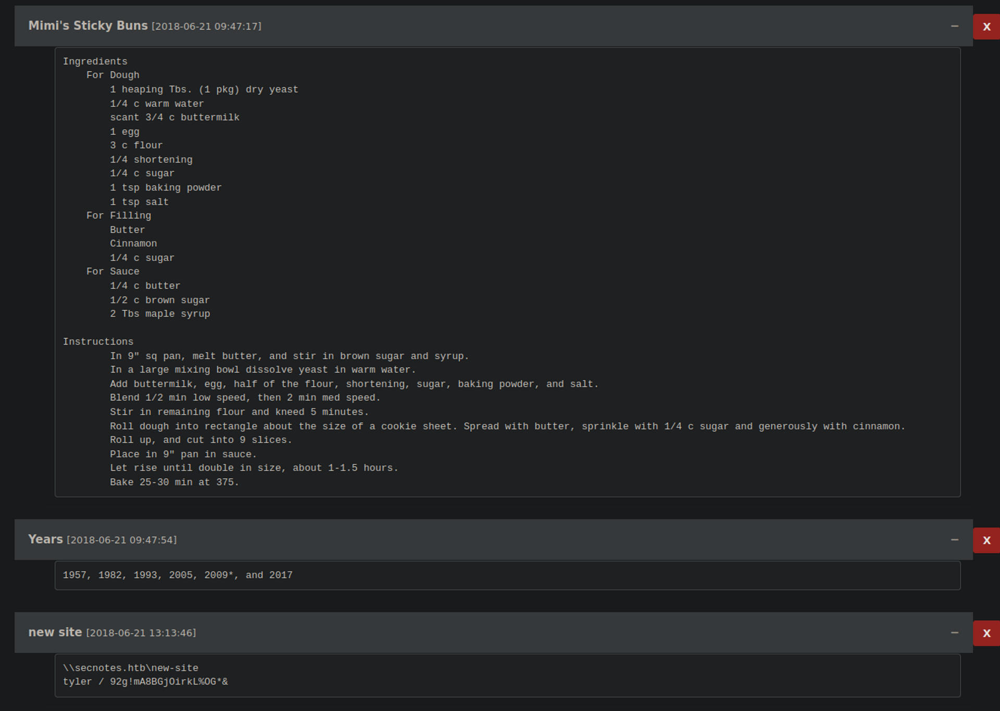
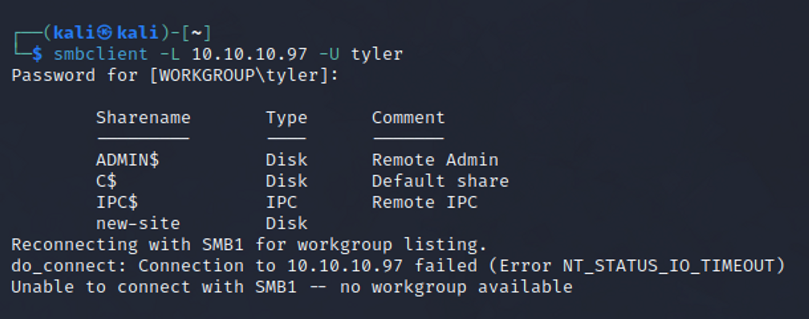
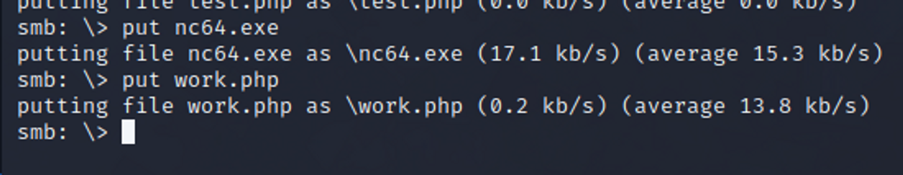
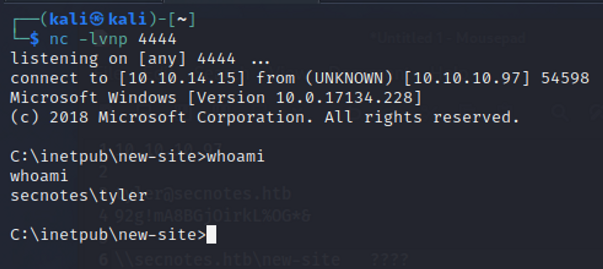
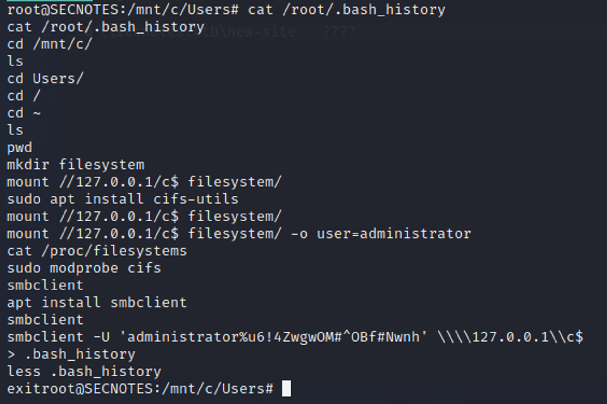

# Secnotes

## 0) Machine Overview:

- This Box runs a PHP application within an IIS webserver.
- There is a SQLi vulnerability that allows us to create a user with a malicious name, and dump the SQL database which ends up containing credentials for user `tyler`
- With those creds, we are able to read/write files into an SMB share, which seems to be connected to the IIS webserver, allowing us to upload `nc64.exe` and a PHP script to execute it.
- After enumerating the machine, we come to notice that it's running WSL. _(Windows Subsystem for Linux)_
- There is a bash.exe file within the filesystem, allowing us to run it and eventually cat out `.bash_history`, containing credentials belonging to `Administrator`.

[Scans](#Scans)
[Walkthrough](#Walkthrough)

## 1) Scans

## 2) Walkthrough

A run down: Through the nmap scan, we can see we have smb, and 2 web servers open. One on 80, and one on 8808.

- First, we tried accessing the smb share, no luck.
- I moved onto the web server on 80. After alot of manual interaction with the website. I was able to use SQL injection to create a user with the username (’OR 1 OR’) that, once logged in, would display excessive information. That being every users notes. Within those notes, there was credentials for tyler.

- So i went ahead and tried those credentials on the SMB server. Which worked. I was only able to access the smb share “new-site”. Which instantly clicked to me, Its the IIS webserver, and i can possible put a malicious file into the smb share and execute it for a reverse shell. Which is what i basically did.

- I put nc64.exe and then a test.php file which contained code to execute nc64.exe to give me a cmd reverse shell.

- Once in the machine, we were given that this was going to use WSL. Which is “windows subsystem for linux” which basically means that there is linux running ontop of the host OS (windows). Similar to a VM, without the VM though. So with the help of some research and PayloadsATT, It was quite straight forward.

- I ran “bash.exe”. Had a shell as root in the Linux system. Tried for some quick wins, and noticed that if we do “history”. We can find administrator credentials for the Host Windows OS.

- Then, i simply connected to the SMB share, which had a C$ drive share, and went and got the flag. (Note: We could also use some impacket scripts with the credentials, like psexec, smbexec, wmiexec)

